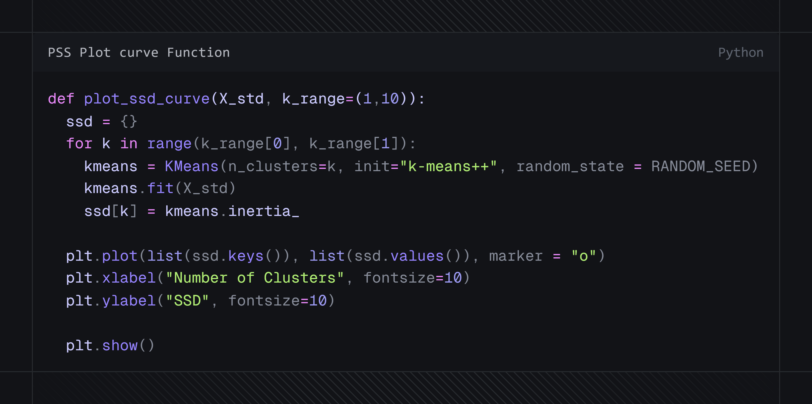
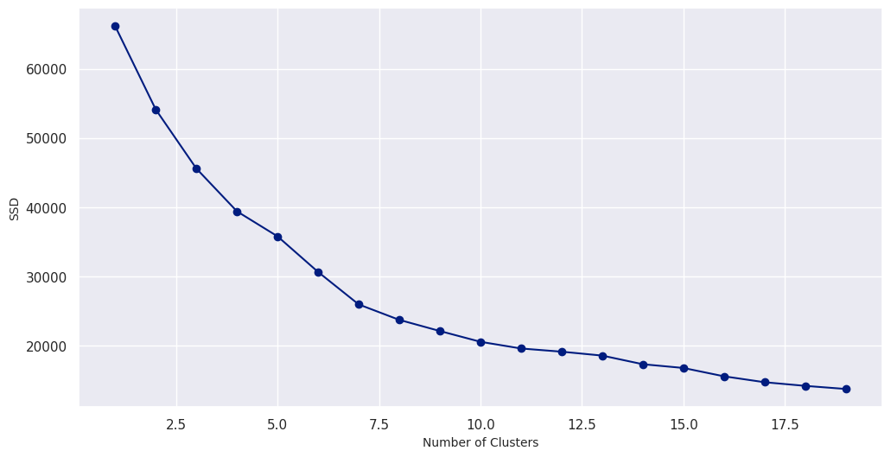
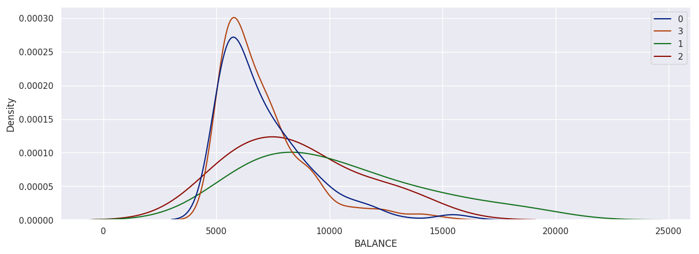

# Customer Segmentation with K-Means Clustering 📊
Questo progetto rappresenta il caso studio finale per il modulo di **Fondamenti di Machine Learning**, realizzato all'interno del mio percorso di **Master Professionale in Data Analytics certificato da ProfessionAI e Alteredu**.

## 🎯 Obiettivo del Progetto
L'obiettivo è segmentare una base clienti di oltre 8.900 titolari di carte di credito per definire strategie di marketing mirate. Il progetto trasforma dati transazionali grezzi in profili comportamentali azionabili per supportare il decision-making aziendale.

## 🛠️ Tech Stack
* **Python** (Pandas, NumPy)
* **Scikit-Learn** (K-Means Clustering, StandardScaler)
* **Data Visualization** (Matplotlib, Seaborn)

## 💡 Workflow Analitico

### 1. Data Cleaning & Imputation
Gestione dei valori mancanti e analisi delle anomalie transazionali per garantire l'integrità del dato.

### 2. Modellazione e Logica di Clustering
Per determinare il numero ottimale di cluster, è stata implementata una funzione personalizzata per il calcolo della *Sum of Squared Distances* (SSD).

Attraverso l'**Elbow Method**, è stato individuato il punto di flesso ideale (K=4).

### 3. Strategia di Segmentazione
Suddivisione della clientela in due macro-target basati sul `BALANCE` (sotto/sopra 5000 USD) per isolare i comportamenti di spesa estremi e migliorare la precisione del modello.

### 4. Analisi Distribuzione Cluster
Utilizzo di **KDE Plots** per analizzare la densità e la separazione dei segmenti rispetto alle variabili chiave.

## 📈 Risultati Strategici
L'analisi ha permesso di identificare cluster specifici su cui concentrare il budget marketing:
* **Cluster A0 & B2**: Alta propensione agli acquisti, target ideali per campagne di fidelizzazione.
* **Cluster A2 & B0**: Clienti con potenziale di indebitamento residuo, target per promozioni su pagamenti rateali.
* **Ottimizzazione Risorse**: Identificazione di cluster a bassa reattività (A1, B3) per ridurre lo spreco di budget pubblicitario.

---
**Analisi a cura di:** [Massimiliano Izzo](https://linkedin.com/in/massimilianoizzo) 
